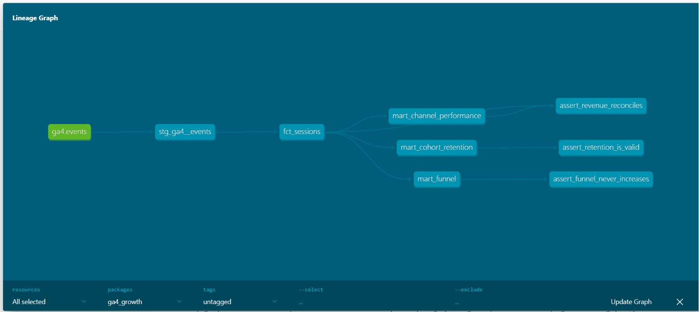

# GA4 Growth Analytics on BigQuery + dbt — Build Guide

**What you'll have at the end:** a public GitHub repo, `ga4-growth-analytics`, containing a dbt project with tests and CI. It turns Google's raw GA4 ecommerce event export into a sessions fact table and three growth marts: a purchase funnel, channel performance, and cohort retention. On top of that sits a one-page Looker Studio dashboard, plus a README with your findings.

**Time:** about 9–10 focused hours. Do Phases 0–4 on Day 1 and Phases 5–9 on Day 2.

**What's already been checked:** every SQL, YAML and config file below has been linted with sqlfluff (BigQuery dialect) and parsed with dbt Core 1.12. CI has also been confirmed to pass both on the empty first commit and on the finished project. None of it has been run against BigQuery itself; that's your job. Treat the exploration in Phase 2 and the reconciliation check in Phase 4 as real verification, not formalities.

---

## Ground rules

**Type each file in yourself.** Don't bulk-paste, and don't move to the next phase until you can explain every line of the current one. Whoever reviews your interview at Elio can ask "why did you do it this way?" The *Why* notes under each file are there so you can answer.

**Use your own numbers.** Every number in your README must come from your own query results. This guide deliberately never tells you what the data says.

**Describe it accurately.** In interviews, call it a self-directed project on Google's public GA4 demo dataset. That is a genuinely good thing to have. Don't stretch it into "production BigQuery experience".

---

## Architecture

```
bigquery-public-data.ga4_obfuscated_sample_ecommerce.events_*
(raw export: 92 daily tables, Nov 2020 – Jan 2021, ~4.3M events)
        │
        ▼
stg_ga4__events              VIEW   one row per event; nested params flattened, placeholders cleaned
        │
        ▼
fct_sessions                 TABLE  one row per session: device, channel, engagement, funnel flags, revenue
        │
        ├──► mart_funnel               TABLE  weekly closed funnel by device and channel
        ├──► mart_channel_performance  TABLE  weekly sessions, conversion, revenue by channel
        └──► mart_cohort_retention     TABLE  weekly new-user retention by first-touch channel
                        │
                        ▼
               Looker Studio dashboard
```

Final repo layout:

```
ga4-growth-analytics/
├── .github/workflows/ci.yml
├── ci/profiles.yml
├── docs/lineage.png
├── macros/ga4_param.sql
├── models/
│   ├── staging/
│   │   ├── _ga4__sources.yml
│   │   ├── _ga4__models.yml
│   │   └── stg_ga4__events.sql
│   └── marts/
│       ├── _marts__models.yml
│       ├── fct_sessions.sql
│       ├── mart_funnel.sql
│       ├── mart_channel_performance.sql
│       └── mart_cohort_retention.sql
├── notes/data_profile.md
├── tests/
│   ├── assert_funnel_never_increases.sql
│   ├── assert_retention_is_valid.sql
│   └── assert_revenue_reconciles.sql
├── .gitignore
├── .sqlfluff
├── .sqlfluffignore
├── dbt_project.yml
├── README.md
└── requirements.txt
```

---

## Sandbox constraints that shape the design

Read this before you start. Several design decisions follow directly from these limits, and each one is a good interview talking point.

| Sandbox constraint | What it means for this project |
|---|---|
| Tables, views and partitions expire after 60 days | Fine for the interview window. If the dashboard breaks later, re-run `dbt build`. |
| Partition expiry is counted from the partition's own date | Never partition by `session_date`. The 2020 partitions would expire immediately and the table would look empty. Cluster instead. |
| No DML (INSERT / UPDATE / MERGE) | No incremental models. Every model is a full rebuild (`create or replace`), which is DDL and works. |
| 1 TiB of query processing per month | Plenty, but still build on a small date window while developing. |
| 10 GiB storage for the life of the sandbox; deleting tables doesn't give it back | Another reason to iterate on small windows and run the full three-month build only once, near the end. |
| The public dataset is in the US multi-region | Your dataset must also be in `US`, or you'll get "not found in location" errors. |

---

## Phase 0 — Write the brief (15 min)

Treat this like an Elio client engagement: start from the business question, not the data. Put this at the top of your README before writing any code.

> **Client question:** An ecommerce store wants to know where it loses customers and which acquisition channels are worth investing in.
>
> 1. Where in the purchase journey do sessions drop off, and does it differ by device?
> 2. Which acquisition channels drive sessions that convert and generate revenue?
> 3. Do new users come back, and does that depend on how they first found the site?

Every model you build should serve one of these three questions. If a model doesn't, leave it out.

---

## Phase 1 — Setup (60 min)

### 1. BigQuery sandbox

1. Go to `console.cloud.google.com/bigquery` and sign in with a Google account.
2. Create a project when prompted, for example `ga4-growth-analytics`.
3. Write down the **project ID** from the project picker. It often has a numeric suffix and isn't always the same as the name.
4. Check for the sandbox banner. You don't need billing.
5. Confirm you can read the dataset by running:

```sql
select count(*) as events
from `bigquery-public-data.ga4_obfuscated_sample_ecommerce.events_20210131`;
```

### 2. Google Cloud CLI

Install it from `cloud.google.com/sdk/docs/install`, then run:

```bash
gcloud auth application-default login
gcloud config set project YOUR_PROJECT_ID
```

### 3. GitHub repo and Python environment

Create a **public** repo called `ga4-growth-analytics` on GitHub, tick "Add a README", then clone it. Use Python 3.12; dbt doesn't support 3.14.

```bash
git clone https://github.com/RohitGKumawat/ga4-growth-analytics.git
cd ga4-growth-analytics
python -m venv .venv
source .venv/bin/activate          # Windows: .venv\Scripts\activate
```

### 4. Scaffold files

Create each of these files in the repo.

**`requirements.txt`**
```
dbt-core~=1.12.0
dbt-bigquery~=1.12.0
sqlfluff~=4.3.0
```

**`dbt_project.yml`**
```yaml
name: ga4_growth
version: "1.0.0"
config-version: 2
profile: ga4_growth

model-paths: ["models"]
macro-paths: ["macros"]
test-paths: ["tests"]

vars:
  # Full dataset is 20201101–20210131. Override with --vars for cheap dev runs.
  start_date: "20201101"
  end_date: "20210131"

models:
  ga4_growth:
    staging:
      +materialized: view
    marts:
      +materialized: table
```

**`.gitignore`**
```
target/
dbt_packages/
logs/
.venv/
venv/
.user.yml
```

**`.sqlfluff`**
```ini
[sqlfluff]
dialect = bigquery
templater = jinja
max_line_length = 120

[sqlfluff:templater:jinja]
apply_dbt_builtins = True
load_macros_from_path = macros

[sqlfluff:rules:capitalisation.keywords]
capitalisation_policy = lower

[sqlfluff:rules:capitalisation.functions]
extended_capitalisation_policy = lower
```

**`.sqlfluffignore`**
```
target/
dbt_packages/
logs/
.venv/
venv/
```

**`ci/profiles.yml`**
```yaml
# Dummy profile so CI can run `dbt parse` without any Google credentials.
ga4_growth:
  target: ci
  outputs:
    ci:
      type: bigquery
      method: oauth
      project: ci-placeholder
      dataset: ci_placeholder
      location: US
```

**`.github/workflows/ci.yml`**
```yaml
name: ci

on:
  push:
    branches: [main]
  pull_request:

jobs:
  lint-and-parse:
    runs-on: ubuntu-latest
    steps:
      - uses: actions/checkout@v5
      - uses: actions/setup-python@v6
        with:
          python-version: "3.12"
      - name: Install dependencies
        run: pip install -r requirements.txt
      - name: Lint SQL
        run: sqlfluff lint .
      - name: Parse dbt project
        run: dbt parse --profiles-dir ci
```

Then install the dependencies:

```bash
pip install -r requirements.txt
```

**Why it's set up this way:**

- **Date range as variables.** You can build on one week while developing, then on three months for the final run, without editing any SQL.
- **Staging as views, marts as tables.** Views use no storage and always reflect the source. Marts are tables so the dashboard reads small, precomputed data.
- **What CI checks.** It lints every SQL file and parses the dbt project, using a dummy profile. That means CI needs no Google credentials, so there are none to leak. It catches SQL syntax and style problems, broken `ref()`s, and invalid YAML before anything merges.
- **What CI does *not* check.** It doesn't execute the models against BigQuery. If you're asked about this, say so precisely.

### 5. Local dbt profile

This file lives **outside** the repo, so credentials can never be committed. Create `~/.dbt/profiles.yml` (on Windows: `C:\Users\<you>\.dbt\profiles.yml`):

```yaml
ga4_growth:
  target: dev
  outputs:
    dev:
      type: bigquery
      method: oauth
      project: YOUR_PROJECT_ID
      dataset: ga4_growth
      location: US
      threads: 4
      job_execution_timeout_seconds: 300
```

Then check the connection:

```bash
dbt debug
```

It should end with "All checks passed!". Commit the scaffold straight to `main`. This is the only commit that skips a branch.

```bash
git add .
git commit -m "Scaffold dbt project, lint config and CI"
git push
```

**Done when:** `dbt debug` passes, and the Actions tab on GitHub shows a green run. It will pass even though there are no models yet.

---

## Phase 2 — Explore the raw data (90 min)

Look at the data before you model it. Run each query below in the BigQuery console, one at a time. Before you press Run, check the "This query will process X" estimate in the top right of the editor.

Create `notes/data_profile.md`. For each query, write down the result and one sentence on what it means for your models.

```sql
-- 1. Size and shape
select
    count(*) as events,
    count(distinct user_pseudo_id) as users,
    count(distinct event_date) as days
from `bigquery-public-data.ga4_obfuscated_sample_ecommerce.events_*`;
```

```sql
-- 2. Which events exist
select
    event_name,
    count(*) as events
from `bigquery-public-data.ga4_obfuscated_sample_ecommerce.events_*`
group by event_name
order by events desc;
```

```sql
-- 3. Which event_params exist, and which value column each uses (one day only, to keep it cheap)
select
    ep.key,
    count(*) as total,
    countif(ep.value.string_value is not null) as string_values,
    countif(ep.value.int_value is not null) as int_values,
    countif(ep.value.float_value is not null or ep.value.double_value is not null) as decimal_values
from `bigquery-public-data.ga4_obfuscated_sample_ecommerce.events_20210131`,
    unnest(event_params) as ep
group by ep.key
order by total desc;
```

```sql
-- 4. How many events cannot be tied to a session
select
    count(*) as events,
    countif(
        (select ep.value.int_value from unnest(event_params) as ep where ep.key = 'ga_session_id') is null
    ) as events_without_session_id
from `bigquery-public-data.ga4_obfuscated_sample_ecommerce.events_*`;
```

```sql
-- 5. Purchase data quality
select
    count(*) as purchase_events,
    count(distinct ecommerce.transaction_id) as distinct_transaction_ids,
    countif(ecommerce.transaction_id is null or ecommerce.transaction_id = '(not set)') as missing_transaction_id,
    countif(ecommerce.purchase_revenue_in_usd is null) as missing_revenue,
    sum(ecommerce.purchase_revenue_in_usd) as revenue_usd
from `bigquery-public-data.ga4_obfuscated_sample_ecommerce.events_*`
where event_name = 'purchase';
```

```sql
-- 6. What acquisition channel values look like
select
    traffic_source.medium,
    traffic_source.source,
    count(distinct user_pseudo_id) as users
from `bigquery-public-data.ga4_obfuscated_sample_ecommerce.events_*`
group by traffic_source.medium, traffic_source.source
order by users desc
limit 20;
```

**What to look for:**

- **Query 3: value columns.** Check which value column `ga_session_id`, `ga_session_number`, `engagement_time_msec` and `session_engaged` actually use. GA4 is known to store `session_engaged` inconsistently, which is why the staging model reads both columns. See whether that shows up in this dataset.
- **Query 4: events without a session ID.** Note what share of events has no session ID. These events can't be assigned to a session, so `fct_sessions` drops them. You need to know how much data that is.
- **Query 5: duplicate and missing transaction IDs.** Check whether there are more purchase events than distinct transaction IDs, and whether `(not set)` appears. Duplicates would make revenue summed per event too high. If you find them, that's your first real modelling decision: dedupe purchases by `transaction_id` in `fct_sessions`, and write down why.
- **Query 6: placeholder channel values.** Look for `<Other>`, `(data deleted)`, NULL or empty strings in the channel fields. Google documents this dataset as obfuscated, with placeholder values and limited internal consistency. Note that your findings are therefore illustrative, not real store performance.

**Done when:** `notes/data_profile.md` has all six results and your interpretation of each.

---

## Phase 3 — Staging model (PR #1, 60 min)

```bash
git checkout -b feat/staging-events
```

**`models/staging/_ga4__sources.yml`**
```yaml
sources:
  - name: ga4
    database: bigquery-public-data
    schema: ga4_obfuscated_sample_ecommerce
    tables:
      - name: events
        identifier: "events_*"
```

**`macros/ga4_param.sql`**
```sql

    (select ep.value.{{ value_type }}_value from unnest(event_params) as ep where ep.key = '{{ key }}')

```

**`models/staging/stg_ga4__events.sql`**
```sql
with source as (
    select *
    from {{ source('ga4', 'events') }}
    where _table_suffix between '{{ var("start_date") }}' and '{{ var("end_date") }}'
),

renamed as (
    select
        event_name,
        user_pseudo_id,
        -- obfuscated data uses NULL and '' as placeholders; normalise so joins and group-bys don't silently drop rows
        coalesce(nullif(device.category, ''), '(not set)') as device_category,
        coalesce(nullif(geo.country, ''), '(not set)') as country,
        coalesce(nullif(traffic_source.source, ''), '(not set)') as first_touch_source,
        coalesce(nullif(traffic_source.medium, ''), '(not set)') as first_touch_medium,
        ecommerce.transaction_id,
        ecommerce.purchase_revenue_in_usd as purchase_revenue_usd,
        parse_date('%Y%m%d', event_date) as event_date,
        timestamp_micros(event_timestamp) as event_ts,
        {{ ga4_param('ga_session_id', 'int') }} as ga_session_id,
        {{ ga4_param('ga_session_number', 'int') }} as ga_session_number,
        {{ ga4_param('page_location') }} as page_location,
        {{ ga4_param('engagement_time_msec', 'int') }} as engagement_time_msec,
        -- GA4 stores session_engaged inconsistently (string in some rows, int in others)
        (
            select coalesce(ep.value.string_value, cast(ep.value.int_value as string))
            from unnest(event_params) as ep
            where ep.key = 'session_engaged'
        ) as session_engaged
    from source
)

select
    renamed.*,
    concat(renamed.user_pseudo_id, '-', cast(renamed.ga_session_id as string)) as session_key
from renamed
```

**`models/staging/_ga4__models.yml`**
```yaml
models:
  - name: stg_ga4__events
    description: One row per GA4 event, with the event_params we need flattened into typed columns.
    columns:
      - name: event_name
        data_tests:
          - not_null
      - name: user_pseudo_id
        data_tests:
          - not_null
```

**Why it's written this way:**

- **The `events_*` wildcard plus `_table_suffix`.** The export is one table per day. The wildcard reads all of them, and filtering on `_table_suffix` means BigQuery only scans the days you ask for. This is the most important cost control in the project.
- **The macro.** Pulling a value out of `event_params` is the same subquery every time. Putting it in one macro means there's one place to fix it if it's wrong.
- **Normalising NULL and `''` to `(not set)`.** Equality comparisons and joins silently drop NULLs. Without this step, users whose channel is NULL would vanish from the cohort join in Phase 5, and nothing would warn you.
- **Materialised as a view.** It uses no storage, and only `fct_sessions` reads from it.

Build it on one week of data, which runs the model and its tests:

```bash
dbt build --select stg_ga4__events --vars "{start_date: '20210101', end_date: '20210107'}"
```

Look at some rows in the console to check the output makes sense:

```sql
select * from `YOUR_PROJECT_ID.ga4_growth.stg_ga4__events` limit 20;
```

Commit and push:

```bash
git add .
git commit -m "Add GA4 staging model with flattened event params"
git push -u origin feat/staging-events
```

Then finish the PR:

1. Open a pull request on GitHub.
2. Wait for the green CI check.
3. Read your own diff as if you were reviewing someone else's code.
4. Merge.
5. Update your local `main`:

```bash
git checkout main && git pull
```

**Done when:** the view exists in BigQuery, both tests pass, and PR #1 is merged.

---

## Phase 4 — Sessions fact table (PR #2, 60 min)

```bash
git checkout -b feat/fct-sessions
```

**`models/marts/fct_sessions.sql`**
```sql
{{ config(cluster_by=['first_touch_medium', 'device_category']) }}

with events as (
    select *
    from {{ ref('stg_ga4__events') }}
    where ga_session_id is not null
)

select
    session_key,
    user_pseudo_id,
    min(event_date) as session_date,
    min(event_ts) as session_start_ts,
    max(ga_session_number) as session_number,
    array_agg(device_category ignore nulls order by event_ts limit 1)[safe_offset(0)] as device_category,
    array_agg(country ignore nulls order by event_ts limit 1)[safe_offset(0)] as country,
    any_value(first_touch_source) as first_touch_source,
    any_value(first_touch_medium) as first_touch_medium,
    countif(event_name = 'page_view') as page_views,
    logical_or(session_engaged = '1') as is_engaged,
    sum(coalesce(engagement_time_msec, 0)) / 1000 as engagement_time_sec,
    logical_or(event_name = 'view_item') as has_view_item,
    logical_or(event_name = 'add_to_cart') as has_add_to_cart,
    logical_or(event_name = 'begin_checkout') as has_begin_checkout,
    logical_or(event_name = 'purchase') as has_purchase,
    count(distinct if(event_name = 'purchase', transaction_id, null)) as transactions,
    sum(if(event_name = 'purchase', coalesce(purchase_revenue_usd, 0), 0)) as revenue_usd
from events
group by session_key, user_pseudo_id
```

**`models/marts/_marts__models.yml`**
```yaml
models:
  - name: fct_sessions
    description: One row per session (user_pseudo_id + ga_session_id), with engagement, funnel flags and revenue.
    columns:
      - name: session_key
        data_tests:
          - unique
          - not_null
      - name: device_category
        data_tests:
          - accepted_values:
              arguments:
                values: ["desktop", "mobile", "tablet"]
              config:
                severity: warn
```

**Why it's written this way:**

- **The grain.** One row per session, where a session is `user_pseudo_id` + `ga_session_id`. This is the standard GA4 definition, because `ga_session_id` alone isn't unique across users.
- **`logical_or`.** It collapses "did this event happen anywhere in the session?" into one true/false per funnel step. The funnel mart is built on these flags.
- **Device and country from the first event.** Taking them from the session's first event means a single session can never be counted under two devices.
- **Clustered, not partitioned.** This follows from the sandbox rule that partitions expire based on their own date.
- **Only a warning for unexpected device values.** The `accepted_values` test on `device_category` is set to warn rather than fail. Surprising values should be investigated, but they shouldn't block the build.
- **Revenue duplicates.** If Phase 2 showed duplicate transactions, this is the model where you handle them.

Build this model and everything upstream of it on the same week:

```bash
dbt build --select +fct_sessions --vars "{start_date: '20210101', end_date: '20210107'}"
```

**Reconcile against the raw data.** This is the check that makes everything downstream trustworthy, so run both queries. The session counts must match exactly. If they don't, find out why before moving on.

```sql
-- Sessions counted directly from the raw export, same week
select
    count(distinct concat(
        user_pseudo_id, '-',
        cast((select ep.value.int_value from unnest(event_params) as ep where ep.key = 'ga_session_id') as string)
    )) as sessions
from `bigquery-public-data.ga4_obfuscated_sample_ecommerce.events_*`
where _table_suffix between '20210101' and '20210107';
```

```sql
-- Sessions in your model, plus a tracking-gap check
select
    count(*) as sessions,
    count(distinct user_pseudo_id) as users,
    countif(is_engaged) / count(*) as engagement_rate,
    countif(has_purchase) as purchasing_sessions,
    countif(has_purchase and not has_view_item) as purchases_without_item_view
from `YOUR_PROJECT_ID.ga4_growth.fct_sessions`;
```

Add `purchases_without_item_view` to `notes/data_profile.md`. Sessions that purchase without viewing an item point to tracking gaps or sessions split in two. That's why the funnel in Phase 5 is "closed".

Commit, then open a PR, wait for CI, and merge, the same way as in Phase 3.

**Done when:** the session counts reconcile, the tests pass, and PR #2 is merged. A device warning is fine as long as you understand what it's flagging.

---

## Phase 5 — Growth marts (PR #3, 75 min)

```bash
git checkout -b feat/growth-marts
```

**`models/marts/mart_funnel.sql`**
```sql
-- Closed funnel: a session only counts at a step if it also hit every earlier step.
with sessions as (
    select * from {{ ref('fct_sessions') }}
),

steps as (
    select
        device_category,
        first_touch_medium,
        date_trunc(session_date, isoweek) as session_week,
        count(*) as sessions,
        countif(has_view_item) as viewed_item,
        countif(has_view_item and has_add_to_cart) as added_to_cart,
        countif(has_view_item and has_add_to_cart and has_begin_checkout) as began_checkout,
        countif(has_view_item and has_add_to_cart and has_begin_checkout and has_purchase) as purchased
    from sessions
    group by session_week, device_category, first_touch_medium
)

select
    steps.*,
    safe_divide(steps.added_to_cart, steps.viewed_item) as view_to_cart_rate,
    safe_divide(steps.began_checkout, steps.added_to_cart) as cart_to_checkout_rate,
    safe_divide(steps.purchased, steps.began_checkout) as checkout_to_purchase_rate
from steps
```

**`models/marts/mart_channel_performance.sql`**
```sql
with sessions as (
    select * from {{ ref('fct_sessions') }}
)

select
    first_touch_medium,
    date_trunc(session_date, isoweek) as session_week,
    count(*) as sessions,
    count(distinct user_pseudo_id) as users,
    countif(is_engaged) as engaged_sessions,
    countif(has_purchase) as converting_sessions,
    sum(transactions) as transactions,
    sum(revenue_usd) as revenue_usd,
    safe_divide(countif(is_engaged), count(*)) as engagement_rate,
    safe_divide(countif(has_purchase), count(*)) as conversion_rate,
    safe_divide(sum(revenue_usd), countif(has_purchase)) as revenue_per_converting_session
from sessions
group by session_week, first_touch_medium
```

**`models/marts/mart_cohort_retention.sql`**
```sql
with sessions as (
    select
        user_pseudo_id,
        session_date,
        session_number,
        first_touch_medium
    from {{ ref('fct_sessions') }}
),

-- Only users whose first-ever session is inside the data window.
-- Without this, people who first visited before Nov 2020 would pollute the cohorts.
new_users as (
    select
        user_pseudo_id,
        date_trunc(min(session_date), isoweek) as cohort_week,
        any_value(first_touch_medium) as first_touch_medium
    from sessions
    where session_number = 1
    group by user_pseudo_id
),

weekly_activity as (
    select distinct
        user_pseudo_id,
        date_trunc(session_date, isoweek) as activity_week
    from sessions
),

cohort_sizes as (
    select
        cohort_week,
        first_touch_medium,
        count(*) as cohort_users
    from new_users
    group by cohort_week, first_touch_medium
),

cohort_activity as (
    select
        new_users.cohort_week,
        new_users.first_touch_medium,
        div(date_diff(weekly_activity.activity_week, new_users.cohort_week, day), 7) as weeks_since_first_visit,
        count(distinct weekly_activity.user_pseudo_id) as active_users
    from new_users
    inner join weekly_activity
        on new_users.user_pseudo_id = weekly_activity.user_pseudo_id
    where weekly_activity.activity_week >= new_users.cohort_week
    group by new_users.cohort_week, new_users.first_touch_medium, weeks_since_first_visit
)

select
    cohort_activity.cohort_week,
    cohort_activity.first_touch_medium,
    cohort_sizes.cohort_users,
    cohort_activity.weeks_since_first_visit,
    cohort_activity.active_users,
    safe_divide(cohort_activity.active_users, cohort_sizes.cohort_users) as retention_rate
from cohort_activity
inner join cohort_sizes
    on
        cohort_activity.cohort_week = cohort_sizes.cohort_week
        and cohort_activity.first_touch_medium = cohort_sizes.first_touch_medium
```

**Append** these entries to the `models:` list in `models/marts/_marts__models.yml`:

```yaml
  - name: mart_funnel
    description: Weekly closed product funnel (view item → add to cart → checkout → purchase) by device and channel.

  - name: mart_channel_performance
    description: Weekly sessions, engagement, conversion and revenue by first-touch medium.

  - name: mart_cohort_retention
    description: Weekly retention of new users, cohorted by first-visit week and first-touch medium.
```

**Why they're written this way:**

- **A closed funnel.** A session only counts at a step if it also hit every earlier step. You saw tracking gaps in Phase 4, so an open funnel could show more purchases than checkouts, and no client would trust that chart.
- **Counts stored next to rates.** The channel mart keeps the raw counts, so rates can be recomputed correctly when rows are combined. Averaging rates across rows gives the wrong answer.
- **Only genuinely new users in cohorts.** A user enters a cohort only if their first session (`session_number = 1`) falls inside the data window. Otherwise, someone who first visited in October would look like a November newcomer and distort the early cohorts.
- **Right-censoring.** Later cohorts have fewer weeks of follow-up; a January cohort can't have 8 weeks of data. That's called right-censoring. Say so in your README, and don't compare week-8 retention across cohorts.
- **First-touch attribution.** `first_touch_medium` is the channel that first acquired the user, not the channel of each session. That's the right attribution for "retention by acquisition channel", but it's a simplification in the channel mart. Say that too.

Build on the whole of January, so the cohorts have several weeks to show:

```bash
dbt build --vars "{start_date: '20210101', end_date: '20210131'}"
```

Open each mart in the console and check that the numbers are plausible. Then commit, open a PR, wait for CI, and merge.

**Done when:** all models build, you've looked through every mart, and PR #3 is merged.

---

## Phase 6 — Business-logic tests and docs (PR #4, 45 min)

```bash
git checkout -b feat/logic-tests
```

**`tests/assert_funnel_never_increases.sql`**
```sql
-- Returns rows (= test failure) if any funnel step is larger than the step before it.
select *
from {{ ref('mart_funnel') }}
where
    added_to_cart > viewed_item
    or began_checkout > added_to_cart
    or purchased > began_checkout
```

**`tests/assert_retention_is_valid.sql`**
```sql
-- Week 0 must be 100% (everyone is active in the week they arrive), and no rate can exceed 100%.
select *
from {{ ref('mart_cohort_retention') }}
where
    (weeks_since_first_visit = 0 and retention_rate != 1)
    or retention_rate > 1
```

**`tests/assert_revenue_reconciles.sql`**
```sql
-- The channel mart must account for the same revenue as the sessions fact table.
with fct as (
    select sum(revenue_usd) as revenue from {{ ref('fct_sessions') }}
),

mart as (
    select sum(revenue_usd) as revenue from {{ ref('mart_channel_performance') }}
)

select
    fct.revenue as fct_revenue,
    mart.revenue as mart_revenue
from fct
cross join mart
where abs(fct.revenue - mart.revenue) > 0.01
```

**What each test protects:**

- **Funnel test.** It guards the closed-funnel logic. If someone later "simplifies" the funnel into an open one, this test fails.
- **Retention test.** It catches cohort bugs such as fan-out joins or the wrong week arithmetic. A mistake there would push rates above 100%, or make week 0 anything other than 100%.
- **Revenue test.** It catches aggregation mistakes between layers. That's exactly the kind of error that makes a dashboard disagree with finance.

With these, the project has **8 data tests**: 5 generic tests in YAML and 3 singular tests.

**Now do the one full three-month build.** With no `--vars`, dbt uses the defaults in `dbt_project.yml`:

```bash
dbt build
```

Then generate the docs:

```bash
dbt docs generate
dbt docs serve
```

In the docs site, open the lineage graph using the icon at the bottom right. Screenshot it and save it as `docs/lineage.png`. Commit, open a PR, wait for CI, and merge.

**Done when:** the full-range `dbt build` is all green, the lineage screenshot is saved, and PR #4 is merged.

---

## Phase 7 — Looker Studio dashboard (60 min)

### Connect the data

1. Go to `lookerstudio.google.com`, click **Create → Report**, and choose the **BigQuery** connector.
2. Pick **My Projects → your project → `ga4_growth` → `mart_channel_performance`**.
3. Add two more data sources the same way, for `mart_funnel` and `mart_cohort_retention`.

### Add calculated fields

Use these instead of the precomputed rate columns. Summing or averaging rates across rows gives wrong numbers.

- In `mart_channel_performance`, add: `Conversion rate = SUM(converting_sessions) / SUM(sessions)`
- In `mart_cohort_retention`, add: `Retention = SUM(active_users) / SUM(cohort_users)`

### Build one page with four blocks

1. **Top row:** scorecards for sessions, revenue, and conversion rate. Use `mart_channel_performance`.
2. **Funnel:** a bar chart from `mart_funnel`. Use `viewed_item`, `added_to_cart`, `began_checkout` and `purchased` as metrics. Add a drop-down control for `device_category`.
3. **Channels:** a table showing `first_touch_medium`, sessions, revenue, and the Conversion rate field. Sort it by revenue.
4. **Retention:** a pivot table from `mart_cohort_retention`.
   - Rows: `cohort_week`
   - Columns: `weeks_since_first_visit`
   - Metric: the Retention field
   - Style: heatmap
   - Add a drop-down control for `first_touch_medium`.

Give every chart a title that states the question it answers, not the table it reads from. For example, "Where do sessions drop off?"

### Share the report

1. Click **Share → Manage access → Anyone with the link can view**.
2. Check that the data source credentials are set to the owner's. That lets viewers see data without needing BigQuery access.
3. Open the link in an incognito window to confirm it works.

**Done when:** the view-only link works in incognito.

---

## Phase 8 — README with findings (PR #5, 60 min)

Replace the README with this structure. Fill every bracket from **your own** results.

````markdown
# GA4 Growth Analytics (BigQuery + dbt)

End-to-end analytics engineering project on Google's public GA4 ecommerce export:
raw nested event data → tested dbt models in BigQuery → growth dashboard.

**Dashboard:** [Looker Studio link] · **Stack:** BigQuery, dbt Core, SQL, sqlfluff, GitHub Actions, Looker Studio

## The question
[your Phase 0 brief]

## Key findings
1. [Funnel finding]
2. [Channel finding]
3. [Retention finding]

## How it's built


[Two or three sentences per layer: staging, fct_sessions, marts]

## Data quality
[From notes/data_profile.md: events without session IDs, purchase duplicates / (not set) transactions,
placeholder channel values, and what you did about each]

## Testing and CI
[The 8 tests and what each protects. CI runs sqlfluff and dbt parse on every pull request.]

## Limitations
- Obfuscated demo data: findings are illustrative, not real store performance.
- First-touch attribution only.
- Later cohorts are right-censored (less follow-up time).
- Full rebuilds only: the BigQuery sandbox doesn't support MERGE, so no incremental models.

## What I'd do next
- Incremental models (MERGE with a lookback window) on a billed project
- Session-scoped source/medium and a comparison against first-touch attribution
- `dbt build` in CI against a dev dataset using a service account
- Item-level product funnel from the `items` array

## Run it yourself
[Setup steps from Phase 1, condensed]
````

**Quality bar for each finding:** state the number, the comparison, and what a client would do about it. Use this shape:

> [Segment] converts at [X]% vs [Y]% for [comparison], and the gap opens at [step], so the first thing to investigate is [action].

Commit, open a PR, wait for CI, and merge. Then pin the repo on your GitHub profile.

**Done when:** the README is merged and the repo is pinned.

---

## Phase 9 — Turn it into interview answers (30 min)

### 30-second version

Fill in the brackets with your own results, then say it out loud until it flows.

> "To get hands-on with a cloud warehouse, I built a dbt project on BigQuery using Google's public GA4 ecommerce export. It takes raw nested event data, flattens and cleans it in a staging layer, builds a session-level fact table, and then three growth marts — funnel, channel performance and cohort retention — feeding a Looker Studio dashboard. It has eight data tests, including one that reconciles revenue between layers, and CI on every pull request. The most useful finding was [finding]."

### How it maps to Elio's job description

| Elio asks for | Your evidence from this project |
|---|---|
| Data lakes / modern data platform | BigQuery, wildcard tables, cost control via `_table_suffix` |
| Clean, well-tested SQL | 8 dbt tests, sqlfluff linting |
| Git, branching, code review, CI | A PR per phase, each gated by GitHub Actions |
| Turn messy data into reliable analytics | Placeholder cleaning, session reconciliation, revenue reconciliation |
| Marketing / growth data | GA4 events, funnel, attribution, retention |
| Explain technical things to non-technical people | The dashboard and README findings |

### Follow-up questions to rehearse

- **"Why dbt instead of scheduled queries?"** Version control, a dependency graph, tests and docs. Also, scheduled queries rely on the Data Transfer Service, which the sandbox doesn't include.
- **"Why aren't the models incremental?"** The sandbox has no MERGE. On a real project, I'd make `fct_sessions` incremental by date, with a lookback window to catch late-arriving events.
- **"How would you productionise this?"** A billed project, a service account, incremental models, `dbt build` on a schedule, CI running against a dev dataset, and source freshness checks.
- **"How does this relate to Databricks?"** It's the same layered pattern; bronze/silver/gold maps onto raw/staging/marts. dbt runs on Databricks too, and my Spark/PySpark work covers the compute side.
- **"What surprised you in the data?"** Answer this from your own `notes/data_profile.md`, not from this guide.

---

## Troubleshooting

| Problem | Fix |
|---|---|
| `Dataset ... was not found in location EU` | Your dataset isn't in US. Set `location: US` in `profiles.yml`, delete the `ga4_growth` dataset in the console, and re-run. |
| `dbt debug` fails on credentials | Re-run `gcloud auth application-default login`. Check that `project:` is the project **ID**, not the display name. |
| dbt won't install | Run `python --version` and use 3.12. dbt doesn't support 3.14. |
| `Scalar subquery produced more than one element` | A param key appears twice in some events. Add `limit 1` inside the subquery in `macros/ga4_param.sql`. |
| CI fails at "Lint SQL" | Run `sqlfluff fix .` locally, review the diff, then commit. |
| A table is unexpectedly empty | Check whether you partitioned it by a date column. In the sandbox, old partitions expire immediately. |
| Tables vanished weeks later | The sandbox's 60-day expiry. Re-run `dbt build`, and the dashboard will work again. |
